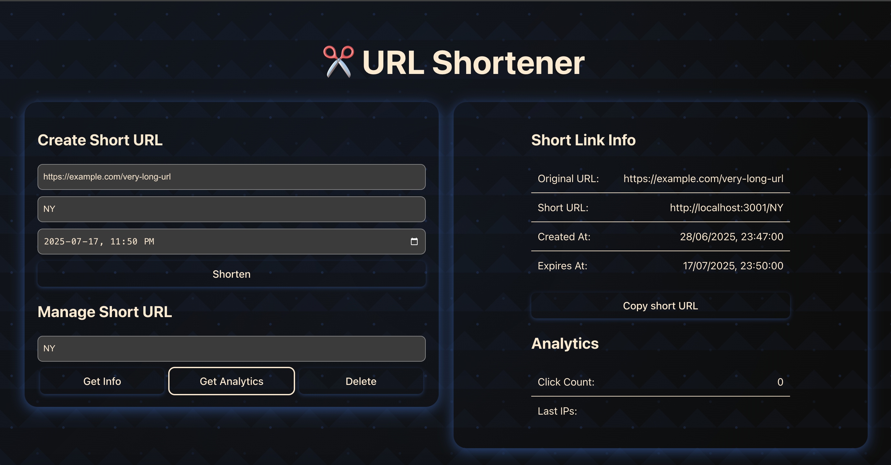

# ✂️ URL Shortener

A modern, stylish **URL Shortener** app built with React + TypeScript, Tailwind CSS, and Framer Motion.  
It allows users to generate short URLs, manage them, and view analytics. All with a beautiful dark-themed UI.

---

## 📸 Screenshot

---

## ⚡ Features

✅ Create short URLs from long URLs  
✅ Optional custom alias (Latin letters, numbers, hyphens, underscores only)  
✅ Set expiration date and time for short links  
✅ Copy short URL to clipboard  
✅ Retrieve and display link info and analytics  
✅ Framer Motion animated transitions  
✅ Beautiful, dark-themed responsive UI  

---

## 🛠 Tech Stack

- **React + TypeScript**
- **Tailwind CSS** for styling
- **Framer Motion** for animations
- **Axios** for API communication
- **Clipboard API** for copy functionality  
- **Nest JS** for backend

---

##  How It Works

➡️ Create a Short URL
Fill in the Original URL (required).

Optionally add a custom alias (must match ^[a-zA-Z0-9-_]*$).

Optionally choose an expiration date-time.

Click Shorten → A short URL is generated and shown alongside details.

➡️ Manage Short URL
Input your short code.

Use Get Info, Get Analytics, or Delete buttons.

➡️ View Info & Analytics
Info panel shows: original URL, short URL, created/expiry date.

Analytics shows: click count and last visitor IPs.

Copy button lets you copy the short URL easily.

### 🐳 Run with Docker

docker-compose up --build
